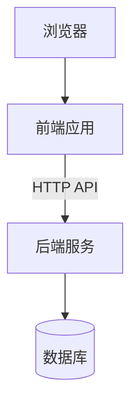

# 系统架构设计

> 组别：____ 编写人：____ 编写日期：____ 版本：v1.0
> 截止：第 1 周周五

## 修订记录

| 版本 | 日期 | 修改人 | 修改说明 |
|------|------|--------|----------|
| v1.0 |      |        | 初稿 |

## 一、技术选型及理由

| 分层 | 选型 | 版本 | 选型理由 |
|------|------|------|----------|
| 前端框架 | | | |
| UI 组件库 | | | |
| 后端框架 | | | |
| 数据库 | | | |
| 缓存（可选） | | | |
| 部署方式 | | | |

## 二、总体架构图

（用 Mermaid 或图片描述，至少体现：浏览器 → 前端应用 → 后端 API → 数据库 的调用关系）

## 三、模块划分

### 3.1 前端模块结构
（页面/路由划分、公共组件、状态管理方案）

### 3.2 后端模块结构
（分层结构：控制层 / 服务层 / 数据访问层，各业务模块划分）

## 四、关键设计决策

| 决策点 | 方案 | 备选方案 | 选择理由 |
|--------|------|----------|----------|
| 登录鉴权方式 | 例：Token | Session | |
| 图片存储方式 | | | |
| 支付模拟方案 | | | |

## 五、环境规划

| 环境 | 用途 | 地址/说明 |
|------|------|-----------|
| 开发环境 | 本地开发 | |
| 演示/生产环境 | 验收演示 | |

## 六、代码规范约定

（命名规范、目录规范、前后端各自的 Lint/格式化工具约定）
